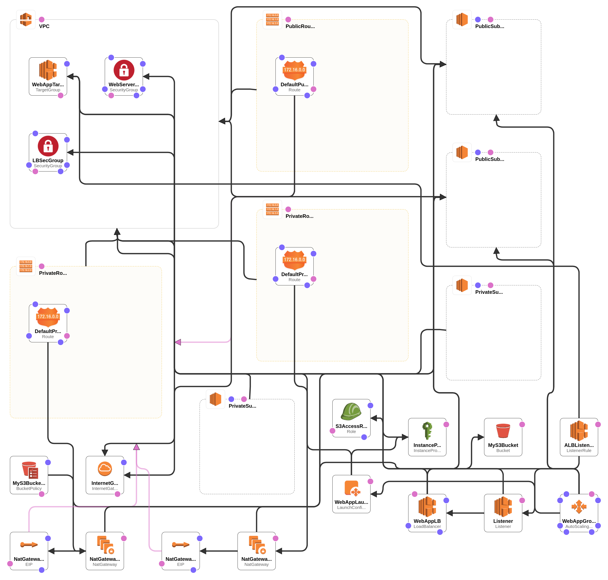
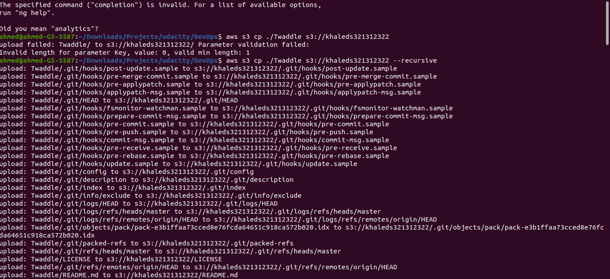
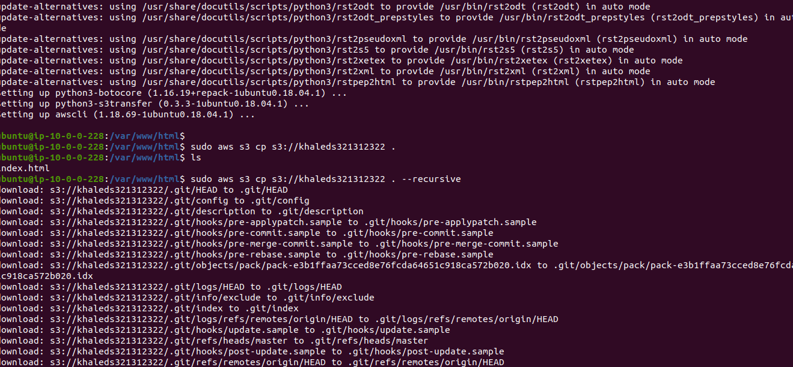
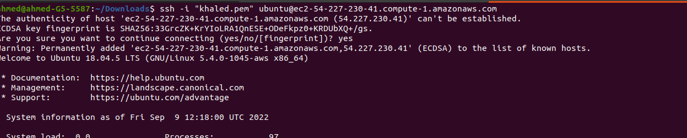

# DevOpsProject

# Deployment Site

## [Twaddle](http://twadd-webap-1vnxpo3zb5gib-1997741451.us-east-1.elb.amazonaws.com/)

# Files

 **webProject1.yml** the cloud formation code write by yml.
 **WebProject1.json** the json file that conatin defination for parameter used in cloud Formations.

    - project files stored in s3 Bucket I Made policy to access it with IAM Profile Instance 
        > I can Connect to Private Subnet with ssh port to connect the EC2 Instance by ssh public key 
# run file 
    > aws cloudformation create-stack  --stack-name twaddle  --template-body file://webProject1.yml --parameters file://webProject1.json --capabilities CAPABILITY_IAM

#TEMPLATE DESIGN.

# upload file. 

# download file in first instance

# download file in second instance

